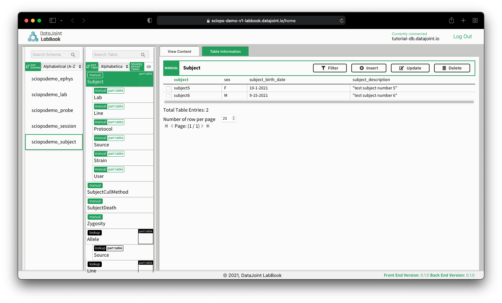

_View the latest documentation site here:_ [{{cookiecutter.docs_url}}]({{cookiecutter.docs_url}}).

<!--intro-start-->

# `{{cookiecutter.__project_name}}`

_A {{cookiecutter.organization}} Workflow for {{cookiecutter.workflow}}_

## Description

TODO: finish description.

Welcome to the {{cookiecutter.organization}} {{cookiecutter.workflow}} pipeline!

This service is designed for a user to upload their raw [_modality type_] data acquired with [_description_], which will then be automatically processed with [_..._]. The service also provides online Jupyter notebooks to visualize the results.

This [workflow](https://github.com/{{cookiecutter.github_user}}/{{cookiecutter.github_repo}}) uses components from open-source packages, including the DataJoint Elements:

- element and url
- element and url

Please follow the steps listed below to begin working with the platform.

## Using the SciOps Services

### Account Setup

1. Create a free account at [accounts.datajoint.io](https://accounts.datajoint.io/signup)


2. Create a free GitHub account at [github.com](https://github.com/signup)

!!! attention
    Please email us at [support@datajoint.com](mailto:support@datajoint.com) after you create these accounts so we can ensure your service is configured properly.

### DataJoint LabBook

_Insert your experimental session metadata._

**Log in to DataJoint LabBook**

[https://labbook.datajoint.io/](https://labbook.datajoint.io/)

- Host: `tutorial-db.datajoint.io`
- Username: `<datajoint.io account username>`
- Password: `<datajoint.io account password>`


DataJoint LabBook displays data from your database.

| Left Column | Middle Column          |           Right Column |
| :---------- | :--------------------- | ---------------------: |
| Schemas     | Tables within a schema | Entries within a table |

**Enter subject information**

- In the left column, navigate to the `subject` schema
- In the middle column, navigate to the `Subject` table
- In the right column, `Insert` a new subject



**Enter session information**

- In the left column, navigate to the `session` schema
- In the middle column, navigate to the `Session` table
- In the right column, `Insert` a new experimental session for the
  subject


**Enter session directory information**

- In the left column, navigate to the `session` schema
- In the middle column, navigate to the `SessionDirectory` table
- In the right column, `Insert` a new entry to identify where the data
  is located (relative to the `inbox` directory)


### DataJoint SciViz

...

### DataJoint Axon (Data Upload/Download)


#### Axon GUI 

1. In the Axon app, on the lower left side, click the 'gear' icon (Config). Enter the following information in each field (See the `Misc` section below for what the generated `json` config file will look like once configured):

- AWS Account ID: `123456789012`

- DataJoint Account Client ID: `xxxxxxxxxxxxxxxxxxxxxx`

- S3 Role: `{{cookiecutter.github_repo}}_researcher_prod`

- S3 Bucket: `dj-sciops`

2. At the top right of the Axon app, click the 'circle arrow' icon (Token). This will open a browser to be able to sign in with your DataJoint account and generate a temporary token.

3. Select the 'S3 Bucket' tab on the left side of the Axon app. Enter the following information to view the current list of files uploaded, the press 'Load':

- S3 Bucket Directory: `{{cookiecutter.github_repo}}/inbox/`

4. To upload a folder to a subfolder within the 'S3 Bucket Directory', for example to upload the subject data folder 'SUBJ100' from your local machine, enter the following path on S3: `{{cookiecutter.github_repo}}/inbox/SUBJ100`

#### Axon CLI

... 

#### Misc

```json
{
  "version": "1.2.0",
  "aws": { "account_id": "123456789012" },
  "s3":
    {
      "role": "{{cookiecutter.github_repo}}_researcher_prod",
      "bucket": "dj-sciops",
    },
  "djauth": { "client_id": "xxxxxxxxxxxxxxxxxxxxxx" },
}
```


### DataJoint CodeBook (JupyterHub)

...

<!--intro-end-->
<!--install-start-->

Thank you for using the {{cookiecutter.organization}}: _{{cookiecutter.workflow}}_ cloud-based platform.

## Installation

!!! note
    The following is intended for developers and is not required for users of the SciOps services.

### 1. Clone the repository

First, clone a local copy of the [project repository](https://github.com/{{cookiecutter.github_user}}/{{cookiecutter.github_repo}}) and change to the location of that directory:

```bash
git clone https://github.com/{{cookiecutter.github_user}}/{{cookiecutter.github_repo}}.git
cd "{{cookiecutter.__project_name}}"
```

### 2. Create a new python environment

We recommend creating an isolated [virtual environment](https://realpython.com/python-virtual-environments-a-primer/) to avoid any conflicts with your existing Python packages or interpreter. You can create a virtual environment by first installing [`conda`/`mamba`](https://github.com/conda-forge/miniforge#mambaforge):

1. Create an environment using the packages listed in `environment.yml`:

```bash
mamba env create -f environment.yml --force
```

2. Activate the new environment:

```bash
conda activate {{cookiecutter.__pkg_import_name}}
```

### 3. Install the package `{{cookiecutter.__project_name}}`

After the new virtual environment has been created and activated, install this python package using `pip>=62.0` (`pip` is already in the list of requirements from the `environment.yml` file).

To avoid installing other additional packages, use the following command (see [_contrib_](./CONTRIBUTING.md#setting-up-a-local-development-environment) for extra installing packages):

```bash
pip install .
```

If you need to uninstall the package, do so with `pip`:

```bash
pip uninstall {{cookiecutter.__project_name}}
```

#### Additional setup for local development and testing

See the [_Development setup_](./CONTRIBUTING.md#setting-up-a-local-development-environment) documentation for information on how to install additional packages and tools for local development and testing environments.

<!--install-end-->
<!--rest-of-doc-start-->

## Project Organization

```
├── .github                 <- GitHub workflows, templates, and actions.
├── configs                 <- Store project/build/analysis configuration files here.
├── data
│   ├── external            <- Data from third party sources.
│   ├── interim             <- Intermediate data that has been transformed.
│   ├── processed           <- The final, canonical data sets for modeling/plots.
│   └── raw                 <- Any original, immutable data files/dumps.
├── docker                  <- Docker image content, e.g., Dockerfile, docker-compose.yml
├── docs                    <- Directory for MkDocs documentation for gh-pages.
├── figures                 <- Generated plots and figures for sharing, reports or documentation.
├── notebooks               <- Jupyter notebooks. Naming convention is a number for
│                              ordering, the creator's initials, and a description.
│                              For example, '1.0-fw-initial-data-exploration'.
├── scripts                 <- Analysis examples or production scripts which rely on
│                              importing the actual Python package, e.g. running queries.
├── src/
│   └── {{cookiecutter.__pkg_import_name}}/          <- Actual Python package where the main functionality goes.
│       └── pipeline/       <- Main schemas and tables used to run the datajoint pipeline.
│       └── populate/       <- Code to run `populate` or to ingest data into the database.
│       └── support/        <- Tables to add functionality to the main pipeline modules.
│       └── tables/         <- Primary end-user tables defined for easy-of-use.
│       └── utils/          <- Package utilities.
│       └── __init__.py     <- Root-level package init file.
│       └── __main__.py     <- Main package script.
│       └── version.py      <- Should only contain the current package version number.
├── tests                   <- Unit and integration tests which can be run with `pytest` or `nox`.
├── .cookiecutter.json      <- Options specified during template generation.
├── .gitignore              <- Files and folders to ignore for git.
├── .pre-commit-config.yaml <- Configuration of pre-commit git hooks.
├── CHANGELOG.md            <- Changelog to keep track of new features and fixes.
├── CONTRIBUTING.md         <- Documentation on how to contribute to the project.
├── *.code-workspace        <- Visual Studio Code workspace file.
├── {{cookiecutter._djconfig}}      <- DataJoint configuration file.
├── environment.yml         <- The conda environment file for new virtual environments.
├── LICENSE                 <- Open source license.
├── mkdocs.yml              <- Configuration for building the documentation with MkDocs.
├── noxfile.py              <- `nox` automation file for continuous integration steps.
├── pyproject.toml          <- Build system configuration for the project.
└── README.md               <- The top-level "read me" for the repository.
```

<!--rest-of-doc-end-->

©️ Datajoint, {% now 'local', '%Y' %}. Licensed under the MIT license.
